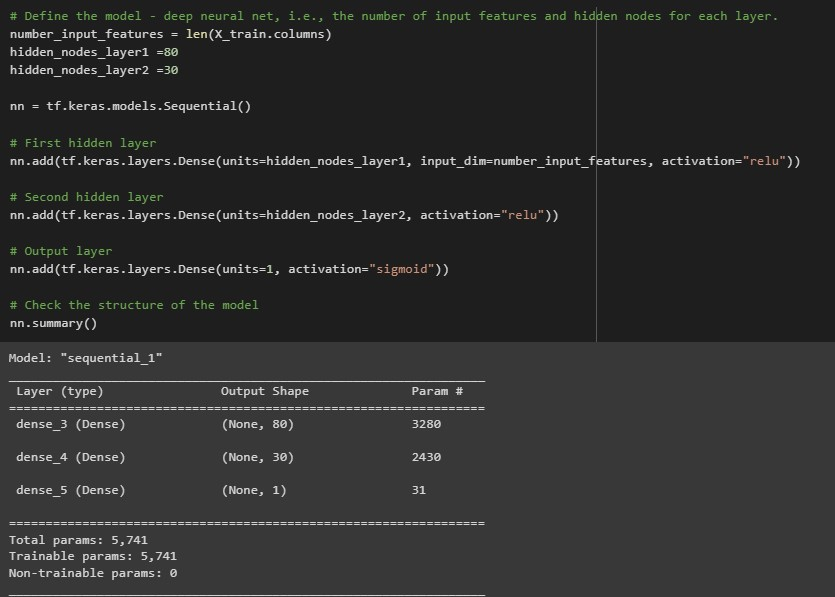

# Module 21 Challenge
## Deep Learning
# Background
The nonprofit foundation Alphabet Soup wants a tool that can help it select the applicants for funding with the best chance of success in their ventures. With your knowledge of machine learning and neural networks, you’ll use the features in the provided dataset to create a binary classifier that can predict whether applicants will be successful if funded by Alphabet Soup.

From Alphabet Soup’s business team, you have received a CSV containing more than 34,000 organizations that have received funding from Alphabet Soup over the years. Within this dataset are a number of columns that capture metadata about each organization, such as:

* EIN and NAME—Identification columns
* APPLICATION_TYPE—Alphabet Soup application type
* AFFILIATION—Affiliated sector of industry
* CLASSIFICATION—Government organization classification
* USE_CASE—Use case for funding
* ORGANIZATION—Organization type
* STATUS—Active status
* INCOME_AMT—Income classification
* SPECIAL_CONSIDERATIONS—Special considerations for application
* ASK_AMT—Funding amount requested
* IS_SUCCESSFUL—Was the money used effectively

# Step 1: Preprocess the Data
## what variable(s) are the target(s) of your model?
    - IS_SUCCESSFUL
## What variable(s) are the feature(s)?
    - INCOME_AMT, ASK_AMT, CLASSIFICATION
## Drop non-beneficial columns
Initially dropped `EIN` and `NAME` columns. but after examining dataset and number of unique values, also dropped `STATUS` and `SPECIAL_CONSIDERATIONS`
## Determine the number of unique values for each column
```python
APPLICATION_TYPE      17
AFFILIATION            6
CLASSIFICATION        71
USE_CASE               5
ORGANIZATION           4
INCOME_AMT             9
ASK_AMT             8747
IS_SUCCESSFUL          2
dtype: int64
```
## For columns with more than 10 unique values, determine the number of data points for each unique value
```python
# Look at APPLICATION_TYPE value counts for binning
clean_app_df['APPLICATION_TYPE'].value_counts()

T3     27037
T4      1542
T6      1216
T5      1173
T19     1065
T8       737
T7       725
T10      528
T9       156
T13       66
T12       27
T2        16
T25        3
T14        3
T29        2
T15        2
T17        1
```

```python
# Look at CLASSIFICATION value counts for binning
clean_app_df['CLASSIFICATION'].value_counts()

C1000    17326
C2000     6074
C1200     4837
C3000     1918
C2100     1883
         ...  
C4120        1
C8210        1
C2561        1
C4500        1
C2150        1
```

```python
# Look at ASK_AMT value counts for binning
clean_app_df['ASK_AMT'].value_counts()

5000        25398
10478           3
15583           3
63981           3
6725            3
            ...  
5371754         1
30060           1
43091152        1
18683           1
36500179        1
```

## Pick a cutoff point to bin "rare" categorical values into `Other` value
```python
# Choose a cutoff value and create a list of classifications to be replaced
# use the variable name `classifications_to_replace`
classcutoff = 1000
classifications_to_replace = b[b < classcutoff].index.tolist()

# Replace in dataframe
for cls in classifications_to_replace:
    application_df['CLASSIFICATION'] = application_df['CLASSIFICATION'].replace(cls,"Other")
    
# Check to make sure binning was successful
application_df['CLASSIFICATION'].value_counts()
```

# Step 2: Compile, Train, and Evaluate the Model


```python
# Evaluate the model using the test data
model_loss, model_accuracy = nn.evaluate(X_test_scaled,y_test,verbose=2)
print(f"Loss: {model_loss}, Accuracy: {model_accuracy}")

268/268 - 1s - loss: 0.5604 - accuracy: 0.7285 - 561ms/epoch - 2ms/step
Loss: 0.560379683971405, Accuracy: 0.7285131216049194
```

# Step 3: Optimize the Model


# Step 4: Write a Report on the Neural Network Model
## Overview of the analysis: 
Using the data provided from the Alphabet Soup foundation, we can come up with a tool that will help to identify whether future funding applicants will be successful in the ventures.

## Results
### Data Preprocessing
* What variable(s) are the target(s) for your model?

        The target variable is the "IS_SUCCESSFUL" column

* What variable(s) are the features for your model?

        The features/independent variables include ask amount, application type, organization type, and income amount

* What variable(s) should be removed from the input data because they are neither targets nor features?

        Variables that were removed were EIN, Name, Status, Special Considerations. Others that could potentially be removed are Affiliation and Use Case
### Compiling, Training, and Evaluating the Model
* How many neurons, layers, and activation functions did you select for your neural network model, and why?
* Were you able to achieve the target model performance?
* What steps did you take in your attempts to increase model performance?
### Summary
* The overall results of the deep learning model. 
* What is your recommendation for a how a different model could solve this classification problem, explain
